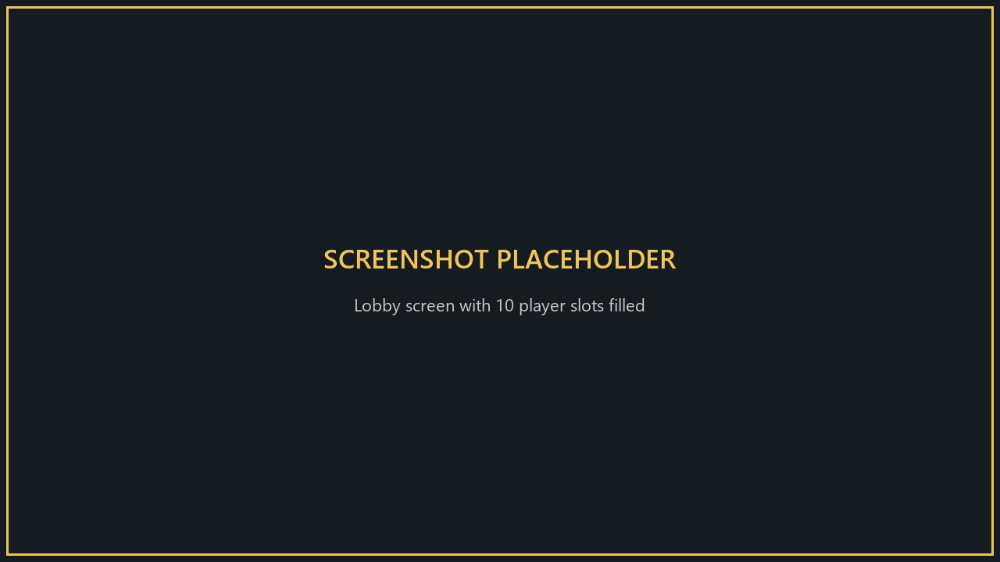
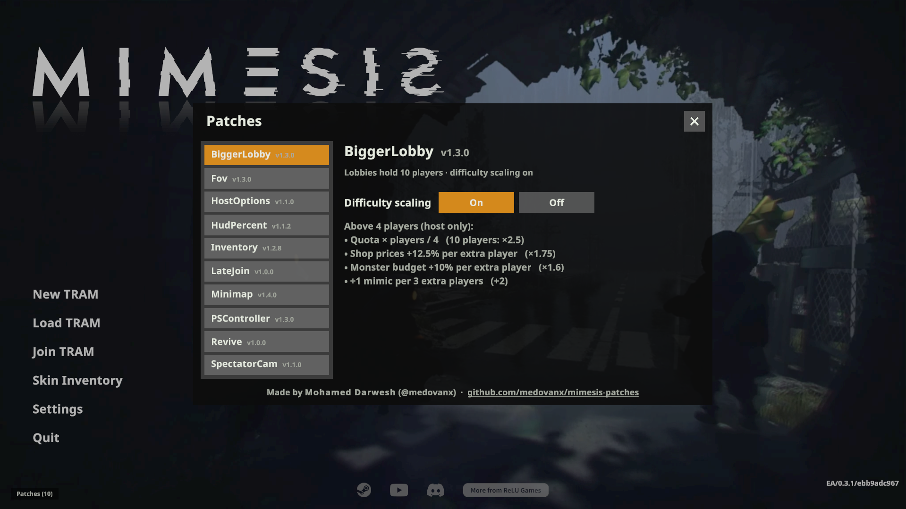

# BiggerLobby

**Version 1.5.4**

Lobbies hold **10 players**, with the UI and difficulty adjusted to match.

**Only the host needs it.**

## Install
Use the [installer](../Installer/), or install [MelonLoader](https://github.com/LavaGang/MelonLoader/releases) (x64, 0.7.x) into the game folder, run the game once, then copy `BiggerLobbyRuntime.dll` from this patch's [release](https://github.com/medovanx/mimesis-patches/releases) into the game's `Mods` folder.

## What you get
- **Player list** (pause/lobby menu): 10 rows, each with volume, mute, profile, kick (host) and ping. Free slots show as **Empty slot**.
- **Result screens**: with more than 4 players, everyone is shown in a 2 × 5 grid.
- **Difficulty scaling** above 4 players:

| What | Formula | 6 players | 8 players | 10 players |
|---|---|---|---|---|
| Quota | × players ÷ 4 | ×1.5 | ×2 | ×2.5 |
| Crow shop / vending prices | +12.5% per player above 4 | ×1.25 | ×1.5 | ×1.75 |
| Monster threat (normal monsters) | +10% per player above 4 | ×1.2 | ×1.4 | ×1.6 |
| Mimics per stage | +1 per 3 players above 4 | +0 | +1 | +2 |

With 4 players or fewer, nothing changes. Loot isn't scaled. Saves stay correct if you load them with a different group size.

## Options

**Patches > BiggerLobby** on the main menu: turn difficulty scaling on/off.

## Uninstall
Use the installer's **Uninstall selected**, or delete `BiggerLobbyRuntime.dll` from the game's `Mods` folder. Installed with Gale or r2modman? Remove or disable it there instead.

## Build
`dotnet build -c Release` in `Runtime`.

## AI disclosure
This mod was made with the help of an AI coding assistant (Claude, by Anthropic): code, documentation and icons.
