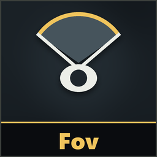
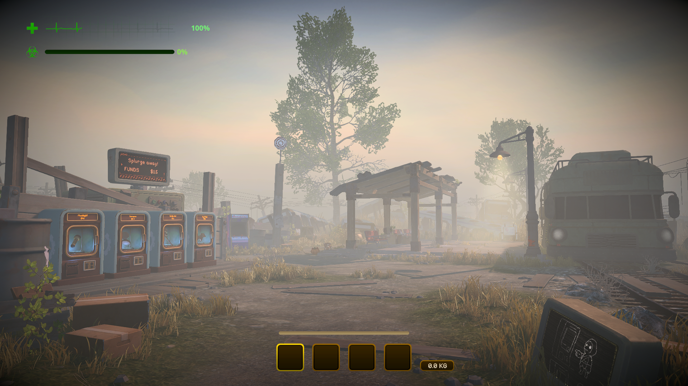
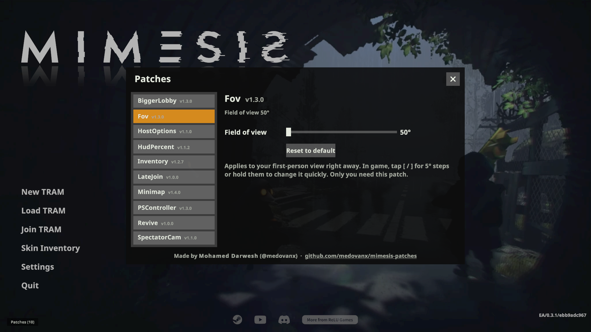

# Fov

**Version 1.5.3**

Adds a **field of view** setting for your first-person view.

Pressing [ or ] in game:

  
  

**Only you need it.**

## Install
Use the [installer](../Installer/), or install [MelonLoader](https://github.com/LavaGang/MelonLoader/releases) (x64, 0.7.x) into the game folder, run the game once, then copy `FovRuntime.dll` from this patch's [release](https://github.com/medovanx/mimesis-patches/releases) into the game's `Mods` folder.

## Use

- **Patches > Fov** on the main menu: slider (50°-120°) or **Reset to default**.
- In game: tap **[** / **]** for 5° steps, or hold them to change it smoothly.

Changes apply right away and are saved.

## Uninstall
Use the installer's **Uninstall selected**, or delete `FovRuntime.dll` from the game's `Mods` folder. Installed with Gale or r2modman? Remove or disable it there instead.

## AI disclosure
This mod was made with the help of an AI coding assistant (Claude, by Anthropic): code, documentation and icons.
