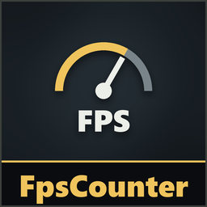

# FpsCounter

**Version 1.1.3**

Shows your frame rate in the bottom-right corner: `FPS: 144`. It updates twice a second, in menus and in game.

**Only you need it.**

## Install
Use the [installer](../Installer/) and tick **FpsCounter**. Or install [MelonLoader](https://github.com/LavaGang/MelonLoader/releases) (x64, 0.7.x) into the game folder, run the game once, and copy `FpsCounterRuntime.dll` from the [latest FpsCounter release](https://github.com/medovanx/mimesis-patches/releases) into the game's `Mods` folder.

## Options
**Patches > FpsCounter** on the main menu: turn it on or off.

## Uninstall
Use the installer, or delete `FpsCounterRuntime.dll` from the game's `Mods` folder. Installed with Gale or r2modman? Remove or disable it there instead.

## AI disclosure
This mod was made with the help of an AI coding assistant (Claude, by Anthropic): code, documentation and icons.
