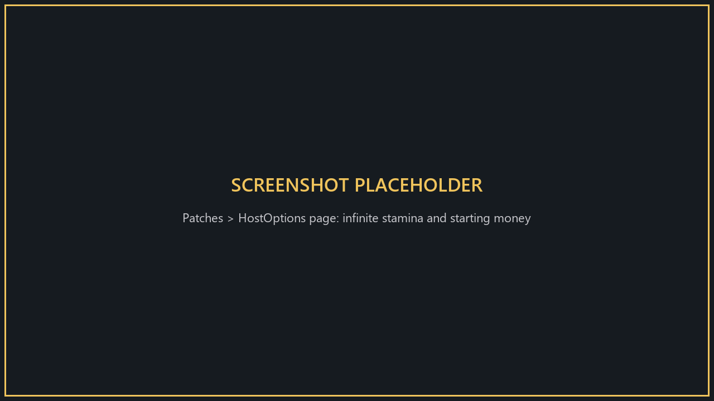
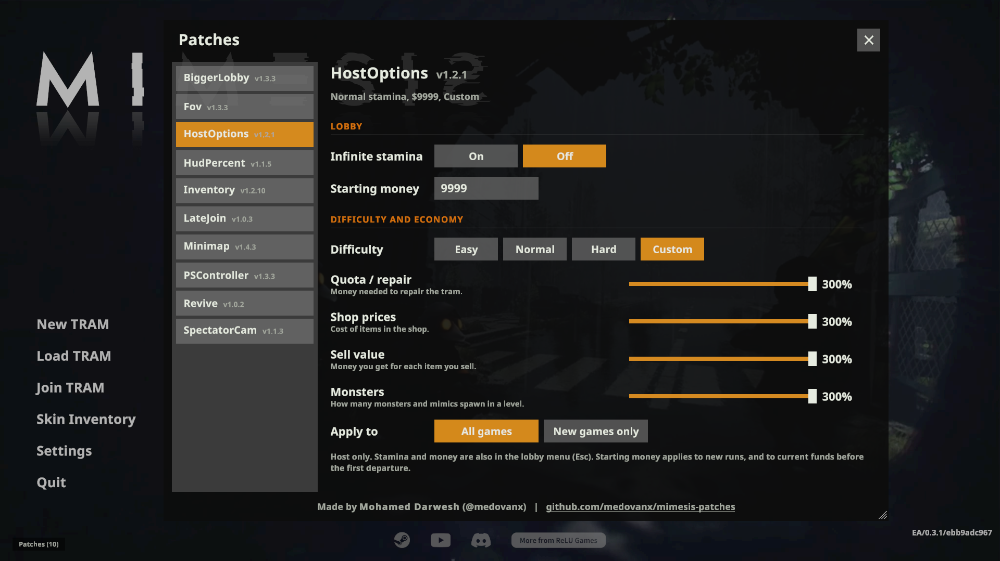

# HostOptions

**Version 1.1.1**

Extra lobby options for the host: **infinite stamina** and **starting money**.

**Only the host needs it.** Other players don't see the controls.

## Install
Use the [installer](../Installer/), or: close the game, put `HostOptionsPatcher.exe` next to `MIMESIS.exe`, run it and choose install (`i`).

## Options

In the lobby menu (Esc), under "Use Entry Password", or in **Patches > HostOptions** on the main menu:
- **Infinite Stamina**: nobody's stamina drains. Monsters are unaffected.
- **STARTING MONEY**: the funds a run starts with (game default $15). Type a value and press Enter or click away. Empty or invalid resets to the default. Changing it before the first departure also sets your current funds.

Settings are saved on your PC.

## Uninstall
Run `HostOptionsPatcher.exe` and choose `u`, or use the installer.
