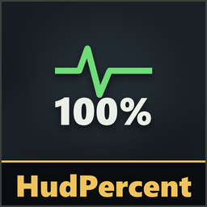
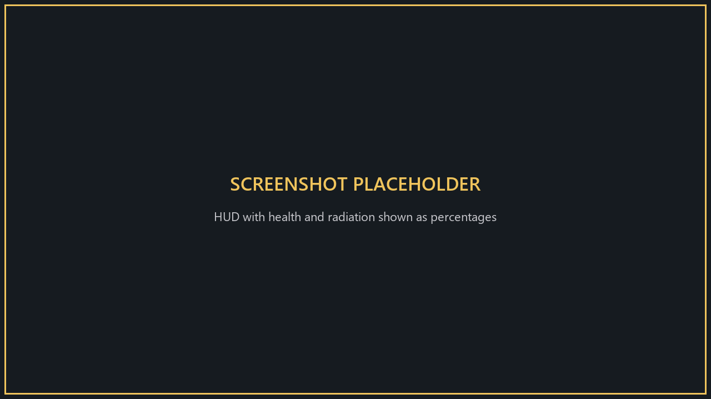
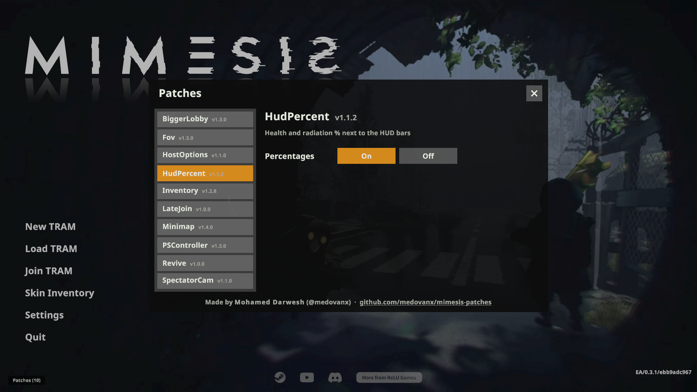

# HudPercent

**Version 1.3.2**

Shows your **health** and **radiation** as percentages next to the bars in the top-left HUD.

**Only you need it.**

## Install
Use the [installer](../Installer/), or install [MelonLoader](https://github.com/LavaGang/MelonLoader/releases) (x64, 0.7.x) into the game folder, run the game once, then copy `HudPercentRuntime.dll` from this patch's [release](https://github.com/medovanx/mimesis-patches/releases) into the game's `Mods` folder.

## What you see
- **Health**: how much you have left (100% = full).
- **Radiation**: how contaminated you are (100% = full bar).

## Options

**Patches > HudPercent** on the main menu: turn it on/off.

## Uninstall
Use the installer's **Uninstall selected**, or delete `HudPercentRuntime.dll` from the game's `Mods` folder. Installed with Gale or r2modman? Remove or disable it there instead.

## AI disclosure
This mod was made with the help of an AI coding assistant (Claude, by Anthropic): code, documentation and icons.
