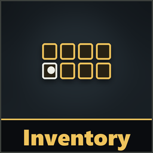
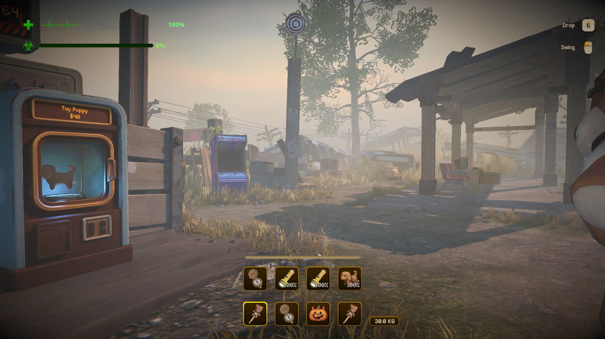
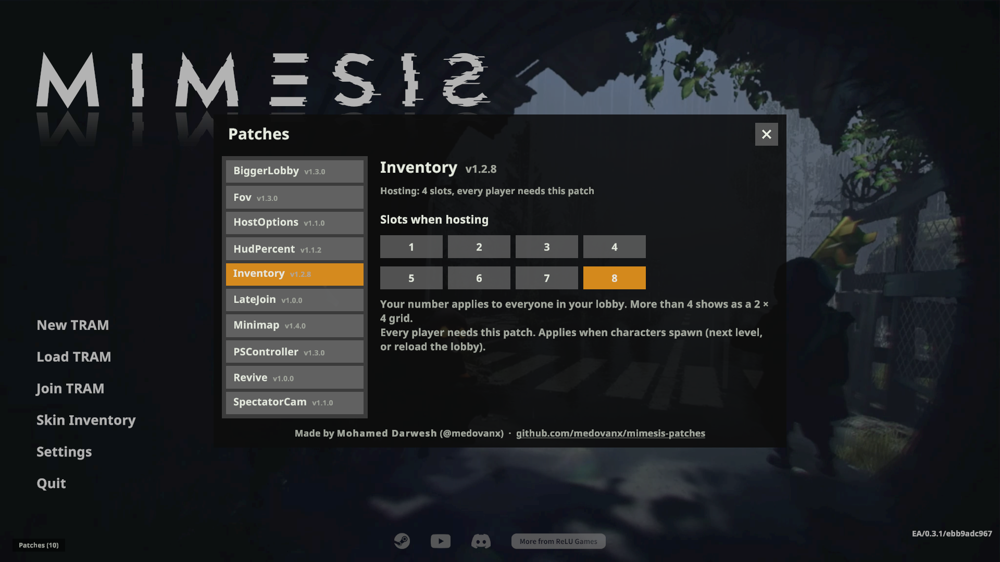

# Inventory

**Version 1.4.2**

The host sets the inventory size to **1-8 slots**. More than 4 shows as a **2 × 4 grid** (slots 1-4 on the bottom row, 5-8 above).

**Every player needs it.** Without it, a player keeps 4 slots and can run into problems when given items in slots 5-8, so make sure everyone installs it before raising the number.

## Install
Use the [installer](../Installer/), or install [MelonLoader](https://github.com/LavaGang/MelonLoader/releases) (x64, 0.7.x) into the game folder, run the game once, then copy `InventoryRuntime.dll` from this patch's [release](https://github.com/medovanx/mimesis-patches/releases) into the game's `Mods` folder.

## Options

**Patches > Inventory** on the main menu: pick the slot count used when you host. Players get it from the host automatically. It applies when characters spawn (next level, or reload the lobby). Changing it never loses items.

## Uninstall
Use the installer's **Uninstall selected**, or delete `InventoryRuntime.dll` from the game's `Mods` folder. Installed with Gale or r2modman? Remove or disable it there instead.

## AI disclosure
This mod was made with the help of an AI coding assistant (Claude, by Anthropic): code, documentation and icons.
