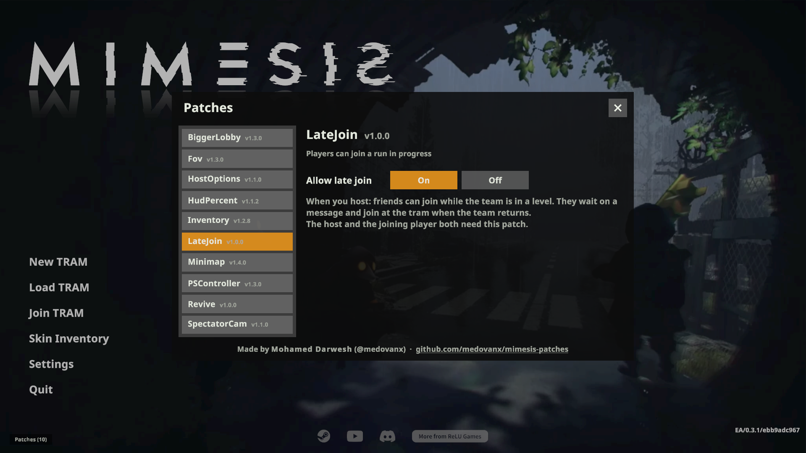

# LateJoin

**Version 1.0.1**

Lets friends **join a game that's already running**. If the team is in a level, you wait on a message and join at the tram when they return, then play from the next stage.

**The host and the joining player both need it.**

## Install
Use the [installer](../Installer/), or: close the game, put `LateJoinPatcher.exe` next to `MIMESIS.exe`, run it and choose install (`i`).

## Options

**Patches > LateJoin** on the main menu: the host can turn it off (on by default).

You can't drop straight into a level in progress; you join at the tram.

## Uninstall
Run `LateJoinPatcher.exe` and choose `u`, or use the installer.
