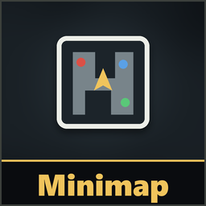
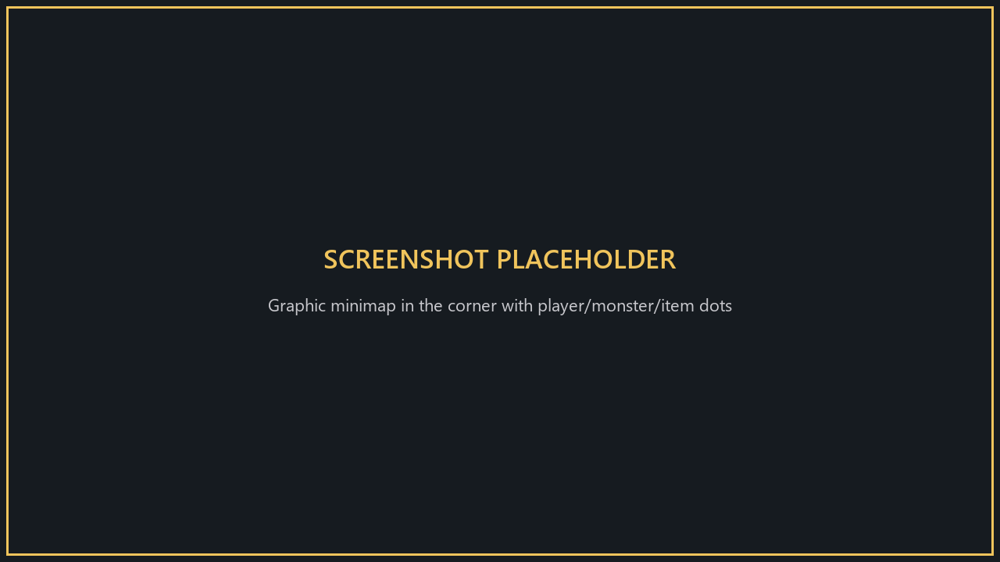
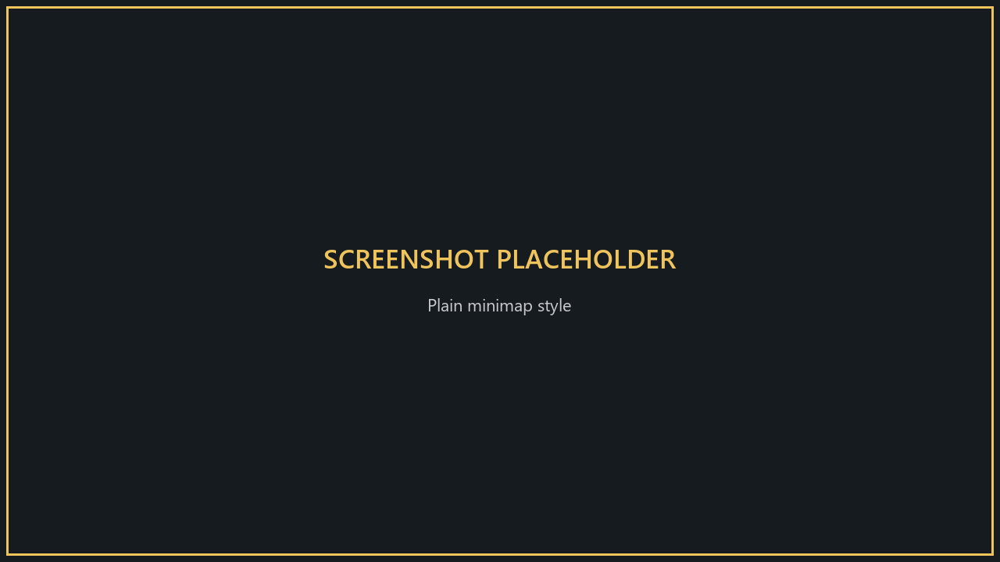
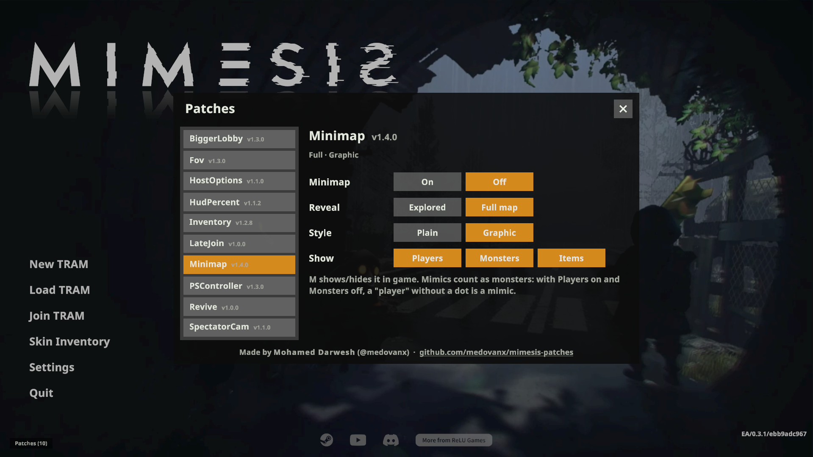

# Minimap

**Version 1.6.1**

A minimap in the bottom-left corner showing your position and facing.

**Only you need it.**

## Install
Use the [installer](../Installer/), or install [MelonLoader](https://github.com/LavaGang/MelonLoader/releases) (x64, 0.7.x) into the game folder, run the game once, then copy `MinimapRuntime.dll` from this patch's [release](https://github.com/medovanx/mimesis-patches/releases) into the game's `Mods` folder.

## Controls
**M** shows or hides the minimap. It's hidden while you're dead or in menus.

## Options

**Patches > Minimap** on the main menu. Settings are remembered.

| Setting | Options |
|---|---|
| Reveal | **Explored** (default): the map appears as you walk near it. **Full map**: everything from the start. |
| Style | **Plain** (default): a clean floor plan of your current floor. **Graphic**: a real top-down view of the level, with dark rooms lit up on the map only. |
| Show | **Players** / **Monsters** / **Items**, each on or off (all off by default). They appear as dots: players blue, monsters red, items yellow. A legend under the map lists them. |

Settings combine: Graphic + Explored shows the real view with unvisited areas darkened.

By default you only see the level and your own arrow, so a "teammate" can still be a mimic. Mimics count as **monsters**: with Players on and Monsters off, a "player" without a dot is a mimic. That changes how the game plays, so it's off unless you turn it on.

## Uninstall
Use the installer's **Uninstall selected**, or delete `MinimapRuntime.dll` from the game's `Mods` folder. Installed with Gale or r2modman? Remove or disable it there instead.

## AI disclosure
This mod was made with the help of an AI coding assistant (Claude, by Anthropic): code, documentation and icons.
