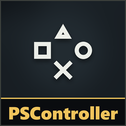
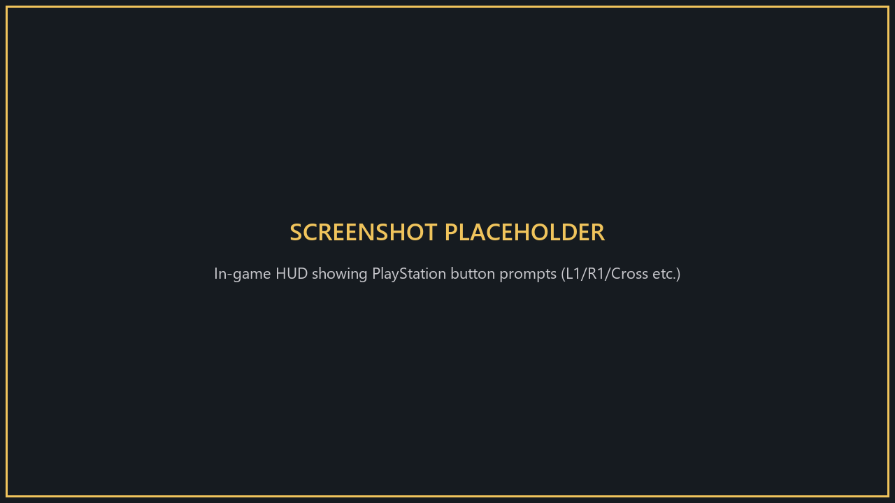
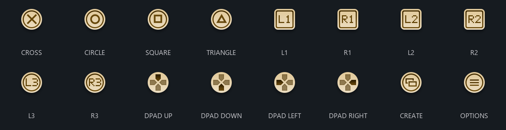
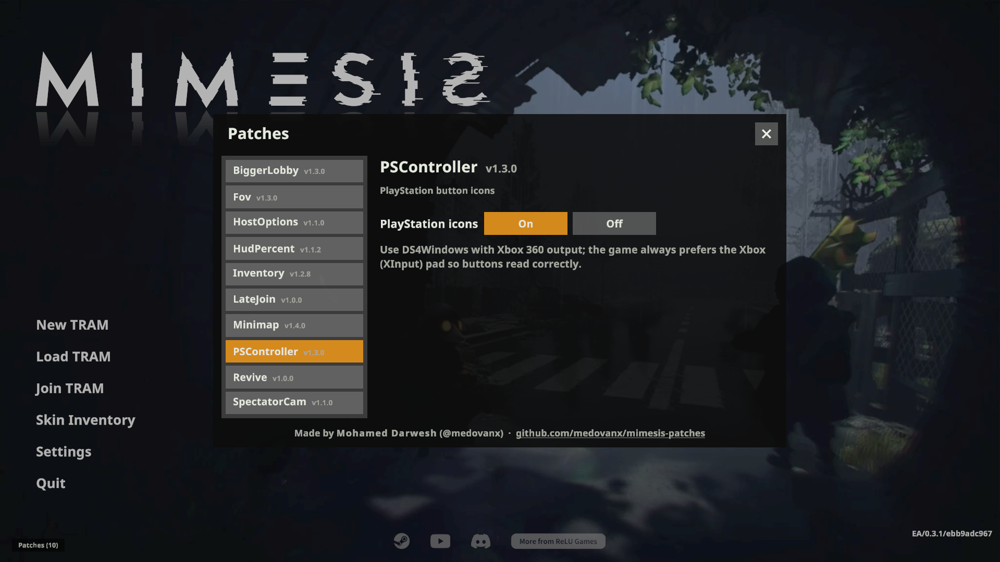

# PSController

**Version 1.5.0**

Shows PlayStation button icons (✕ ○ □ △, L1/R1/L2/R2, L3/R3) instead of Xbox ones.

The full icon set:

**Only you need it.**

## Install
Use the [installer](../Installer/), or install [MelonLoader](https://github.com/LavaGang/MelonLoader/releases) (x64, 0.7.x) into the game folder, run the game once, then copy `PSControllerRuntime.dll` from this patch's [release](https://github.com/medovanx/mimesis-patches/releases) into the game's `Mods` folder.

## Controller setup
Use **DS4Windows** so your PS4/PS5 controller is read reliably:
- Set the output to **Xbox 360**. Don't use DualShock 4 output: L1 registers as LT and rebinding saves the wrong buttons. The PS icons come from this patch either way.
- Turn on **Hide DS4 Controller** (HidHide) so the game only sees the virtual pad.
- Tip: in DS4Windows **Auto Profiles**, load your Xbox profile automatically when `MIMESIS.exe` runs.
- After switching, use **Reset keys** in the game's controls menu, since old binds may be wrong.

| Your button | Icon shown |
|---|---|
| ✕ ○ □ △ | ✕ ○ □ △ |
| L1 / R1 | L1 / R1 |
| L2 / R2 | L2 / R2 |
| L3 / R3 (stick clicks) | L3 / R3 |

## Options

**Patches > PSController** on the main menu: turn it on/off.

## Troubleshooting
`Player.log` has a `[PSController] Gamepads: ...` line showing which pad the game uses. To log every button press, create an empty `PSController-debug.txt` in the `Mods` folder; delete it when done.

## Uninstall
Use the installer's **Uninstall selected**, or delete `PSControllerRuntime.dll` from the game's `Mods` folder.

## Build
`dotnet build -c Release` in `Runtime`.
