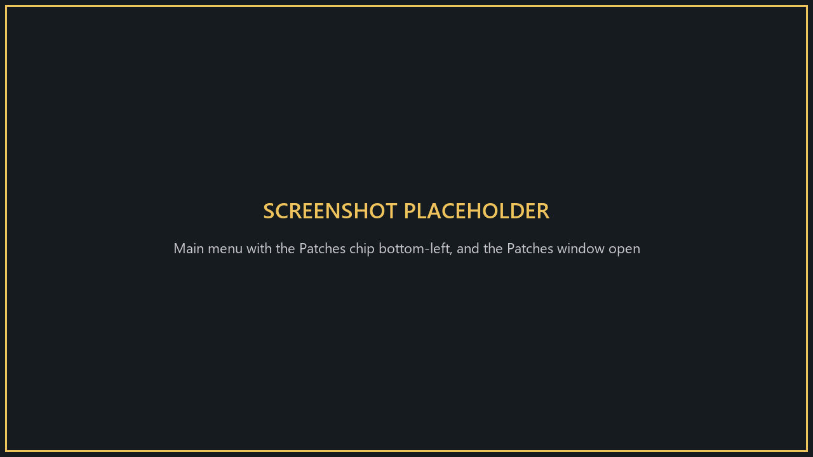
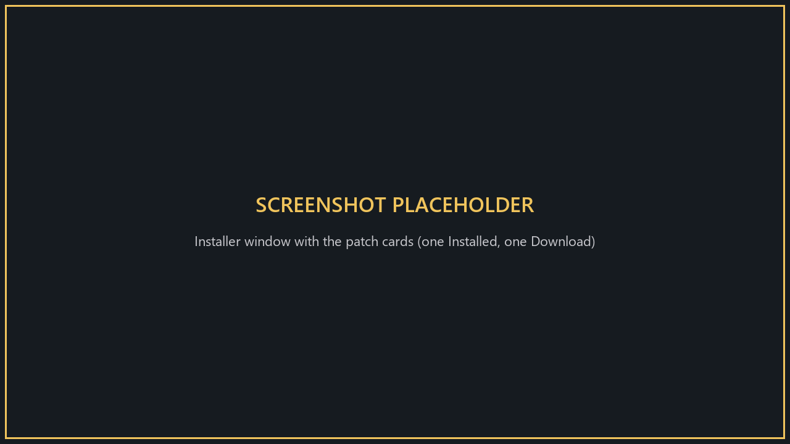
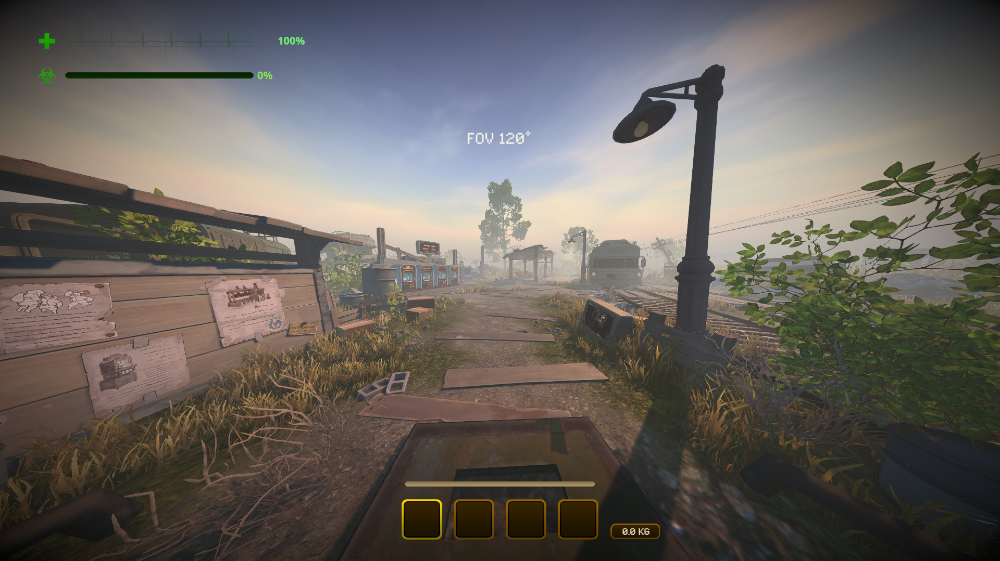
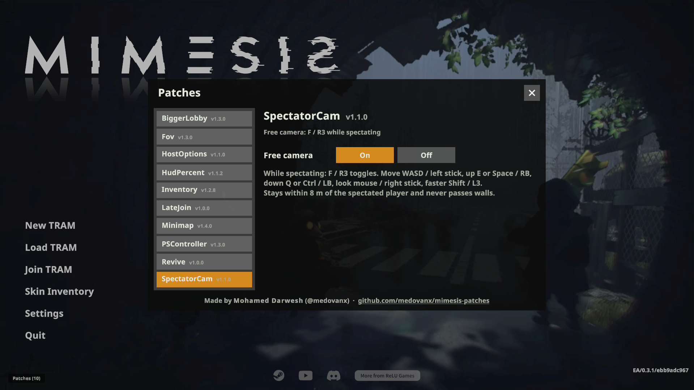

# MIMESIS Patches

Patches for MIMESIS (EA 0.3.1). Each patch is a [MelonLoader](https://github.com/LavaGang/MelonLoader) mod, your game files are never modified, and you can combine any of them.

## Install
1. Download **`MimesisPatchesInstaller.exe`** from the [Releases page](https://github.com/medovanx/mimesis-patches/releases).
2. Run it, tick the patches you want and click **Install / update selected**. It installs MelonLoader for you if you don't have it, and moves older installs over automatically. See [Installer](Installer/).
3. In game, click the **Patches** chip in the bottom-left of the main menu to turn patches on/off and change their options. It turns orange when an update is available.

The mods are also coming to Thunderstore (team medovanx, MIMESIS community), so you'll be able to install them with r2modman or Gale.

To install by hand instead: install [MelonLoader](https://github.com/LavaGang/MelonLoader/releases) (x64, 0.7.x) into the game folder and run the game once, then copy `<Patch>Runtime.dll` from the patch's [release](https://github.com/medovanx/mimesis-patches/releases) into the game's `Mods` folder.

## Patches

| Patch | Version | Host | Player | What it does |
|---|---|---|---|---|
| [BiggerLobby](BiggerLobby/) | 1.5.1 | Yes | No | 10-player lobbies, with UI for 10 and difficulty that scales with player count |
| [PSController](PSController/) | 1.5.1 | Optional | Optional | PlayStation button icons instead of Xbox ones |
| [SpectatorCam](SpectatorCam/) | 1.3.1 | Optional | Optional | Free spectator camera, limited to the area around the player you're watching |
| [Minimap](Minimap/) | 1.6.1 | Optional | Optional | Minimap: explored or full map, plain or graphic, optional players/monsters/items |
| [HostOptions](HostOptions/) | 1.4.1 | Yes | No | Lobby options: infinite stamina, starting money, difficulty and economy |
| [Inventory](Inventory/) | 1.4.1 | Yes | Yes | 1-8 inventory slots (2 × 4 grid), set by the host |
| [LateJoin](LateJoin/) | 1.2.1 | Yes | Yes | Join a game in progress; you enter at the tram when the team returns |
| [Fov](Fov/) | 1.5.1 | Optional | Optional | Field of view setting; [ and ] change it in game |
| [Revive](Revive/) | 1.2.1 | Yes | No | Stand next to a dead teammate to revive them |
| [HudPercent](HudPercent/) | 1.3.1 | Optional | Optional | Health and radiation percentages next to the HUD bars |
| [FpsCounter](FpsCounter/) | 1.1.1 | Optional | Optional | Frame rate in the bottom-right corner |

**Host / Player**: who needs the patch. *Yes* = required, *No* = not needed, *Optional* = personal feature, install it if you want it.

## Screenshots

<table>
<tr><td align="center"><a href="BiggerLobby/"> BiggerLobby</a></td><td align="center"><a href="PSController/"> PSController</a></td><td align="center"><a href="Minimap/"> Minimap</a></td></tr>
<tr><td align="center"><a href="HostOptions/"> HostOptions</a></td><td align="center"><a href="Inventory/"> Inventory</a></td><td align="center"><a href="Fov/"> Fov</a></td></tr>
<tr><td align="center"><a href="HudPercent/"> HudPercent</a></td><td align="center"><a href="SpectatorCam/"> SpectatorCam</a></td><td align="center"><a href="LateJoin/"> LateJoin</a></td></tr>
<tr><td align="center"><a href="Revive/"> Revive</a></td></tr>
</table>

## Uninstall
Run the installer and click **Uninstall selected** or **Uninstall all**, or delete the patch's DLL from the game's `Mods` folder. MelonLoader stays installed.

## Build
Use the .NET 10 SDK. Clone the repo into the game folder as `Patches` (next to `MIMESIS.exe`) and run `dotnet build -c Release` in `<Patch>/Runtime`. The builds find the game on their own; to build from elsewhere, pass `-p:GameDir="<path to the MIMESIS folder>\"`. The MelonLoader reference comes from NuGet (`LavaGang.MelonLoader`). `Common/` holds code shared by all patches.

See [CHANGELOG.md](CHANGELOG.md) for what changed in each version.

## Releasing
`python tools/release.py Fov HostOptions --note "What changed"` bumps the version, updates the CHANGELOG and README, builds, commits, creates the GitHub release (installer and in-game updates) and uploads to Thunderstore (Gale / r2modman). Add `--minor` for a minor version, `--no-thunderstore` for GitHub only, `--dry-run` to preview. Thunderstore uploads need a service account token in `THUNDERSTORE_TOKEN`.

## AI disclosure
These mods were made with the help of an AI coding assistant (Claude, by Anthropic): code, documentation and icons.
