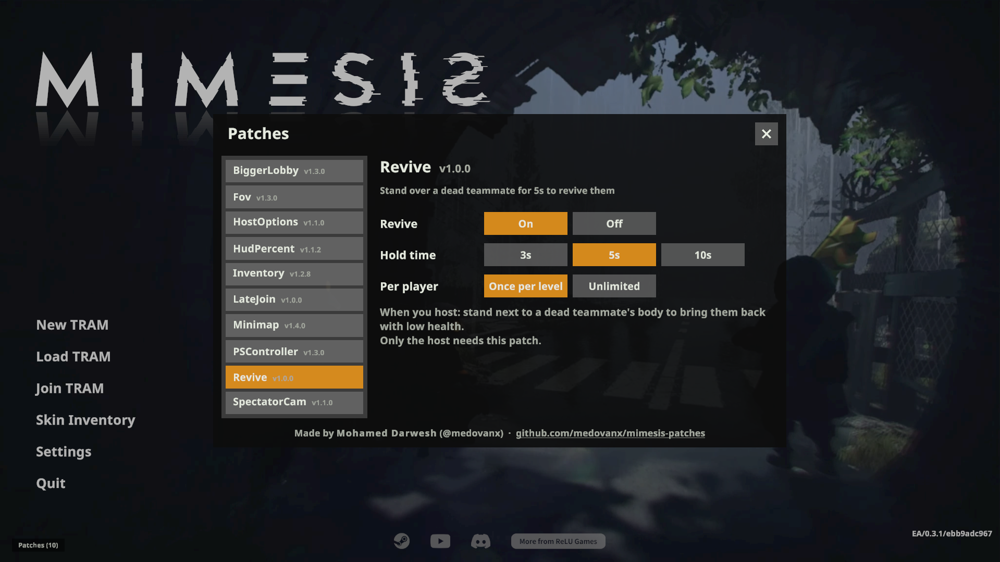

# Revive

**Version 1.0.2**

**Revive a dead teammate** during a level: stand next to their body for a few seconds and they come back with low health.

**Only the host needs it.**

## Install
Use the [installer](../Installer/), or: close the game, put `RevivePatcher.exe` next to `MIMESIS.exe`, run it and choose install (`i`).

## Options

**Patches > Revive** on the main menu:
- On/off
- Hold time: 3 / 5 / 10 s (default 5 s)
- Per player: once per level (default) or unlimited

There's no progress bar yet; just stay next to the body.

## Uninstall
Run `RevivePatcher.exe` and choose `u`, or use the installer.
