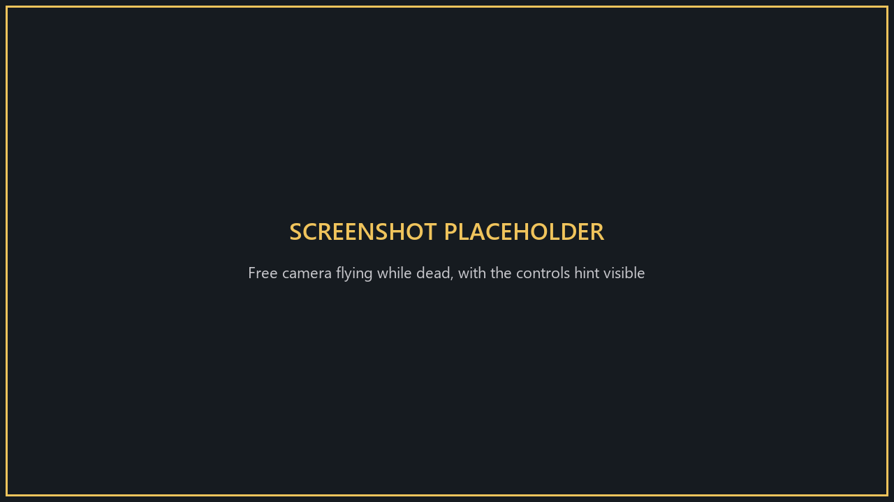

# SpectatorCam

**Version 1.1.0**

A free camera while you're dead, limited to the area around the player you're spectating.

<!-- SCREENSHOT TODO: replace screenshots/spectate.png with: Free camera flying while dead, with the controls hint visible -->

**Only you need it.**

## Install
Use the [installer](../Installer/), or: close the game, put `SpectatorCamPatcher.exe` next to `MIMESIS.exe`, run it and choose install (`i`).

## Controls (while spectating)
| | Keyboard / mouse | Controller |
|---|---|---|
| Free camera on/off | **F** | **R3** |
| Move | W A S D | Left stick |
| Up / down | E or Space / Q or Ctrl | RB / LB |
| Look | Mouse | Right stick |
| Faster | Shift | L3 |

Switching to another player returns you to the normal camera.

## Limits
- The camera stays within **8 m** of the player you're watching.
- It can't pass through walls, so you can't scout other rooms.

## Options
**Patches > SpectatorCam** on the main menu: turn it on/off.

## Uninstall
Run `SpectatorCamPatcher.exe` and choose `u`, or use the installer.
