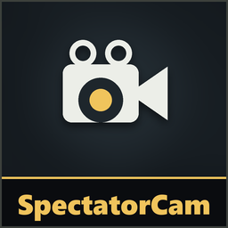

# SpectatorCam

**Version 1.3.2**

A free camera while you're dead, limited to the area around the player you're spectating.

**Only you need it.**

## Install
Use the [installer](../Installer/), or install [MelonLoader](https://github.com/LavaGang/MelonLoader/releases) (x64, 0.7.x) into the game folder, run the game once, then copy `SpectatorCamRuntime.dll` from this patch's [release](https://github.com/medovanx/mimesis-patches/releases) into the game's `Mods` folder.

## Controls (while spectating)
| | Keyboard / mouse | Controller |
|---|---|---|
| Free camera on/off | **F** | **R3** |
| Move | W A S D | Left stick |
| Up / down | E or Space / Q or Ctrl | RB / LB |
| Look | Mouse | Right stick |
| Faster | Shift | L3 |

Switching to another player returns you to the normal camera.

## Limits
- The camera stays within **8 m** of the player you're watching.
- It can't pass through walls, so you can't scout other rooms.

## Options

**Patches > SpectatorCam** on the main menu: turn it on/off.

## Uninstall
Use the installer's **Uninstall selected**, or delete `SpectatorCamRuntime.dll` from the game's `Mods` folder. Installed with Gale or r2modman? Remove or disable it there instead.

## AI disclosure
This mod was made with the help of an AI coding assistant (Claude, by Anthropic): code, documentation and icons.
